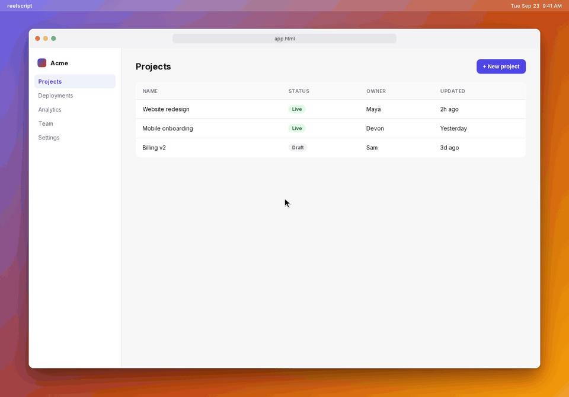

# reelscript



<sup>Made with reelscript, by reelscript: CI renders [examples/basic.ts](examples/basic.ts) inside the published container on every push to `main` and commits the result.</sup>

**Product demos as code.** Write a script, render a demo, re-run it in CI when your UI changes.


Screen-recording tools (Screen Studio, Arcade, Tango) all rot the same way: your product UI changes and your beautiful demo is now a lie, so you re-record it by hand. reelscript makes a demo a *build artifact*. The video is generated from a script, so when your UI updates you just re-run it.

```ts
import { createDemo } from "@reelscript/cli";

const demo = createDemo({ theme: "macos", viewport: [1280, 800], fps: 60 });

await demo.browser.goto("https://app.local");
await demo.cursor.moveTo("#new-project", { ease: "smooth" });
await demo.cursor.click();

demo.zoom.to("#modal", { scale: 1.6 });
demo.say("Give it a name, and hit Create.");
await demo.type("#project-name", "Acme Q3 Launch", { wpm: 400 });
await demo.cursor.moveTo("#create");
await demo.cursor.click();
demo.zoom.out();
await demo.waitForNarration();

await demo.render("out/demo.mp4");
```

## How it works

- **Code-first, not a UI timeline.** The demo is a script you version, diff, and review.
- **Deterministic offline rendering.** Every step is scripted, so frames are produced one at a time: drive a headless Chromium to the state for frame *n*, capture it, composite the animated cursor and zoom, and pipe it to ffmpeg. Perfect 60fps with no dropped frames, and it runs headless in CI.
- **The page's clock is virtual.** reelscript replaces timers, `requestAnimationFrame`, `Date`, and `performance.now` inside the page and steps CSS transitions through the Web Animations API, advancing exactly one frame per rendered frame. A 200ms fade is 12 frames at 60fps no matter how slow capture is.
- **Cinematic layer.** Eased cursor motion, click ripples, zoom-to-element, accelerated typing. The polish that makes a demo feel produced, done as math over frames rather than captured motion.
- **Own the DOM.** Targets are CSS selectors, and `browser.mockAPI()` returns canned JSON so demos never depend on a live backend, real credentials, or flaky auth.
- **Clean stage.** The `macos` theme composites the page into a browser window on a mocked macOS desktop, so there is nothing to tidy up before recording.
- **A real desktop.** Windows have positions, sizes, focus, and z-order. Open a browser and a terminal side by side, click between them, and the one you click comes to the front. Selectors resolve in the focused window (or the one you name), typing goes to the focused window, and zoom targets can be in any window.
- **Terminal windows.** `terminal.open()` puts a Terminal-style window on the desktop and `terminal.run()` types a command and streams its output. Declare the output in the script, or run the real command once with `reelscript record` and replay the recording frame-exact on every render.
- **Narration as code.** `say()` speaks a line while the actions continue, sentences never overlap, and `waitForNarration()` paces the timeline to the voice. The default voice is Kokoro, an open-weights model that runs on CPU with no account, so it works offline and in CI. Plug in any engine through the `tts` option.

## Install

```sh
npm install -D @reelscript/cli
npx playwright install chromium
```

The package installs a `reelscript` command. Scripts are ES modules that use top-level `await`; set `"type": "module"` in your package.json, or the CLI will run them as modules for you. (The unscoped name is blocked by npm's similarity rule against `rescript`, hence the scope.)

## Try it

```sh
git clone https://github.com/trevin-lee/reelscript && cd reelscript
npm install
npx playwright install chromium
npm run example            # renders examples/basic.ts -> out/basic.mp4
```

The example drives a small dashboard app that ships with the repo, so it is fully self-contained. A 6.5s demo at 1424x992 / 60fps renders in about 15s on an M-series laptop.

## Run in CI

The container is the canonical render environment: Chromium, ffmpeg, the theme font, and the narration model are all baked in, so a script renders the same pixels on every machine and never downloads anything at run time.

```sh
docker run --rm -v "$PWD:/work" ghcr.io/trevin-lee/reelscript:main render demo.ts --out demo.mp4
```

Tags: `main` tracks the main branch, `sha-<commit>` pins a build, and each release adds `<version>` and `latest`.

In GitHub Actions:

```yaml
jobs:
  demo:
    runs-on: ubuntu-latest
    container: ghcr.io/trevin-lee/reelscript:main
    steps:
      - uses: actions/checkout@v5
      - run: reelscript render demo.ts --out demo.mp4
```

Scripts may `import { createDemo } from "@reelscript/cli"` without installing the package locally; the CLI resolves it to its own copy.

## CLI

```sh
reelscript render  <script.ts> [--out demo.mp4]        # render a script to video
reelscript preview <script.ts> --at 2.5 [--out f.png]   # render the single frame at 2.5s
```

`preview` is the fast way to iterate on a moment of a demo without waiting for the whole video.

## API

| Call | What it does |
| --- | --- |
| `createDemo({ theme, viewport, desktop, fps, deterministic, gif, voice, tts, pronunciations })` | `theme`: `"macos"` or `"bare"`. `viewport` is the first window's content size, `desktop` the output size (default: the first window plus margins). Defaults: macos, 1280x800, 60fps, deterministic clock on, Kokoro voice `af_heart`. |
| `demo.browser.goto(url, { settle })` | Navigate, then hold for `settle` ms (default 400). |
| `demo.browser.mockAPI(pattern, json, { status })` | Fulfil matching requests with canned JSON. |
| `demo.cursor.moveTo(target, { ease, duration, window })` | Glide to a selector or `{x, y}` in the focused window, or in `window`. Duration defaults from distance. Eases: `smooth`, `snappy`, `overshoot`, `linear`. |
| `demo.cursor.click({ button })` | Click at the cursor, with a ripple. Focuses and raises the window under the cursor. |
| `demo.zoom.to(target, { scale, duration, ease, window })` | Animate a zoom centred on a target. Runs alongside the actions that follow. |
| `demo.zoom.out({ duration, ease })` | Return to 1x. |
| `demo.type(selector, text, { wpm })` | Focus the field and type at `wpm` (default 300). |
| `demo.press(key)` | Press a key or chord, e.g. `"Enter"`, `"Meta+K"`. |
| `demo.wait(ms)` | Hold. |
| `demo.browser.focus()`, `demo.terminal.focus()` | Bring a window to the front and direct typing to it. |
| `demo.browser.place({ x, y, width, height })`, `demo.terminal.place(...)` | Move or resize a window. `x, y` is the frame origin in desktop pixels; `width, height` is the content size. |
| `demo.terminal.open({ title, prompt, fontSize, x, y, width, height })` | Open a terminal window and focus it. The first window opened takes the main position; later ones cascade to the lower right unless placed. |
| `demo.terminal.run(cmd, { output, duration, wpm, speed, maxGapMs })` | Type `cmd`. With `output`, stream that text. Without it, replay the recording for `cmd` from `recordings/`. |
| `demo.say(text, { voice, speed })` | Queue narration. Starts immediately or after the previous sentence, while following actions run. |
| `demo.waitForNarration()` | Hold until everything queued with `say()` has been spoken. |
| `demo.render(path)` | Render to `.mp4` (H.264) or `.gif` (palette-optimized, 960px / 20fps by default, see `gif` option). Honours `REELSCRIPT_OUT` and `REELSCRIPT_SNAPSHOT_AT`, which the CLI uses. |

## Status

Early but working end to end. Roadmap, roughly in order:

- An editor window built on VS Code's web workbench
- Window open/close animations and drag-to-move
- Pseudo-terminal recording for TTY-only tools
- Captions generated from narration (SRT and burned-in)
- Auto-zoom that follows the cursor, and zoom transitions with a bit of drift
- `watch` mode with live preview while editing a script
- Retina (2x) output
- Transitions between scenes and callouts
- Python bindings over the same timeline
- A Linux desktop backend (Xvfb in a container) for demos of native apps, targeted by coordinates or accessibility names

## Several windows

```ts
const demo = createDemo({ viewport: [1180, 720], desktop: [1600, 1000] });
await demo.browser.goto("https://app.local");
await demo.terminal.open({ title: "acme", x: 700, y: 560, width: 840, height: 360 });
await demo.terminal.run("npm run deploy", { output: "Live at https://acme.app\n" });
await demo.cursor.moveTo("#new-project", { window: "browser" }); // the browser is behind the terminal
await demo.cursor.click();                                        // click raises it
```

Each window is its own Chromium page; the desktop composites them in z-order with the theme's frames and shadows. See [examples/desktop.ts](examples/desktop.ts).

## Terminal demos

```ts
await demo.terminal.open({ title: "acme", prompt: "acme % " });
await demo.terminal.run("npm install -D @reelscript/cli", { output: "\nadded 38 packages in 2s\n" });
await demo.terminal.run("node --version"); // replayed from recordings/node-version-<hash>.json
```

Declared output never executes anything, so it renders identically everywhere. For real commands, run

```sh
reelscript record examples/terminal.ts
```

once (or in CI whenever your CLI changes): it executes every `terminal.run` that has no `output`, captures stdout and stderr with timestamps, and saves `recordings/<command-slug>.json` next to the script. Rendering replays the recording with long silences capped (`maxGapMs`) and optional `speed`, and never needs the tool installed. Commit the recordings; they're small JSON. Commands run through a shell with `FORCE_COLOR=1` and a 256-color `TERM`, without a pseudo-terminal, so tools that insist on a TTY for progress bars may print their non-interactive output.

See [examples/terminal.ts](examples/terminal.ts).

## Narration

`say()` uses [Kokoro-82M](https://huggingface.co/onnx-community/Kokoro-82M-v1.0-ONNX) through the optional `kokoro-js` dependency. The model (about 90 MB) downloads on first use into `~/.cache/reelscript` (override with `REELSCRIPT_CACHE`); `reelscript warmup` fetches it ahead of time, and the container image ships with it baked in. Synthesized clips are cached by text and voice, so re-renders don't re-synthesize unchanged lines. Voices include `af_heart`, `af_bella`, `am_michael`, `bf_emma`, `bm_george` and more.

GIF output has no audio track; narration still paces the timeline. Render to `.mp4` for sound.

To skip the model entirely, install with `npm install --omit=optional` and pass your own `tts` engine, or don't call `say()`.

## Requirements

Node 20+. ffmpeg is bundled via `ffmpeg-static`; set `REELSCRIPT_FFMPEG` to use your own.

## License

MIT
