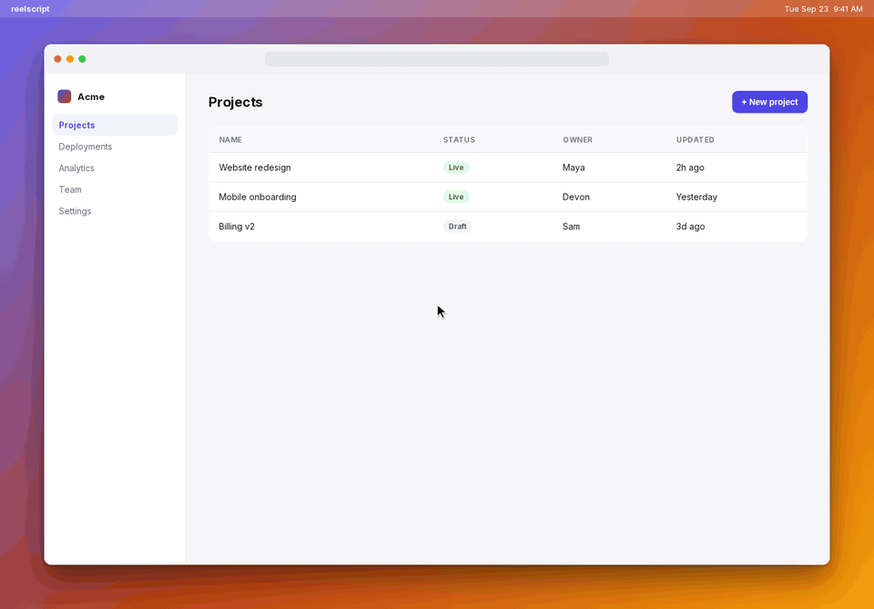

# reelscript



<sup>Made with reelscript, by reelscript: CI renders [examples/basic.ts](examples/basic.ts) inside the published container on every push to `main` and commits the result.</sup>

**Product demos as code.** Write a script, render a demo, re-run it in CI when your UI changes.

Screen-recording tools (Screen Studio, Arcade, Tango) all rot the same way: your product UI changes and your beautiful demo is now a lie, so you re-record it by hand. reelscript makes a demo a *build artifact*. The video is generated from a script, so when your UI updates you just re-run it, and `reelscript check` tells you in CI when a UI change has broken a demo.

```ts
import { createDemo } from "@reelscript/cli";

const demo = createDemo({ viewport: [1280, 800], camera: "follow" });

await demo.browser.goto("https://app.local");
await demo.cursor.moveTo("#new-project");
await demo.cursor.click();

demo.say("Give it a name, and hit Create.");
await demo.type("#project-name", "Acme Q3 Launch", { wpm: 400 });
await demo.cursor.moveTo("#create");
await demo.cursor.click();
await demo.waitForNarration();

await demo.render("out/demo.mp4");
```

## How it works

- **Code-first, not a UI timeline.** The demo is a script you version, diff, and review.
- **Deterministic offline rendering.** Frames are produced one at a time: drive a headless Chromium to the state for frame *n*, capture it, composite the animated cursor and zoom, and pipe it to ffmpeg. Every frame is there, the same frames every time, and it runs headless in CI. (Chromium's text rasterizing and video decoding can vary pixel values invisibly between runs, so compare renders by eye or by PSNR, not byte for byte. What's on screen at each frame, and when, doesn't vary.)
- **The page's clock is virtual and pinned.** reelscript replaces timers, `requestAnimationFrame`, `Date`, `performance.now`, and the time `Intl` and `Temporal.Now` read inside the page and its iframes, seeds `Math.random`, steps CSS and Web Animations, and moves `<video>`, `<audio>` and SVG animations, one frame per rendered frame, inside web components' shadow roots too. A 200ms fade is 12 frames at 60fps no matter how slow capture is, and the page's date is the same on every render.
- **A camera that follows the action.** `camera: "follow"` eases in toward each click and the typing caret, holds, and eases back out when things go quiet. Or place zooms by hand with `zoom.to()`.
- **Cinematic layer.** Eased cursor motion, click ripples, zoom-to-element, accelerated typing, done as math over frames rather than captured motion.
- **Own the DOM.** Targets are Playwright selectors, and `browser.mockAPI()` returns canned JSON so demos needn't depend on a live backend.
- **A clean desktop.** The `macos` theme puts windows on a mocked macOS desktop, so there's nothing to tidy up before recording.
- **Browser, terminal, and VS Code windows.** Open them side by side, click between them, and the one you click comes to the front. The editor is a real VS Code that loads real extensions, including the one you're building.
- **Narration as code.** `say()` speaks a line while the actions continue, and `waitForNarration()` paces the timeline to the voice. The default voice is Kokoro, an open-weights model that runs on CPU with no account, so it works offline and in CI.

## Install

```sh
npm install -D @reelscript/cli
npx reelscript warmup browser
```

The package installs a `reelscript` command, and `warmup browser` downloads the Chromium build it drives. (Use it rather than `npx playwright install`, which installs the build for your project's own Playwright if it has one.) On Linux, add `--with-deps` to install the system libraries Chromium needs too, with apt-get on Debian and Ubuntu; reelscript names the missing ones if a launch fails. Scripts are ES modules that use top-level `await`; set `"type": "module"` in your package.json, or the CLI will run them as modules for you. Commit your lockfile: it pins reelscript and the browser it drives, so renders don't change under you. (The unscoped name is blocked by npm's similarity rule against `rescript`, hence the scope.)

Requires Node 20.11 or later, on macOS or Linux. ffmpeg is bundled.

## Try it

```sh
git clone https://github.com/trevin-lee/reelscript && cd reelscript
npm install
npx playwright install chromium   # inside the repo, Playwright is reelscript's own, so this is the right build
npm run example            # renders examples/basic.ts -> examples/out/basic.mp4
```

The example drives a small dashboard app that ships with the repo, so it's fully self-contained. Rendering takes about three times the video's length on an M-series laptop; `preview` renders a single frame in a few seconds.

## Writing a demo

A script creates a demo with `createDemo()`, queues actions, and ends with `await demo.render(path)`. A few rules hold everywhere:

- **Paths in a script are relative to the script's folder**, wherever you run it from: the render output, `session`, `recordingsDir`, an editor's `workspace` and `extensions`, and a local page in `browser.goto("./app.html")` (anything with a scheme, like `https://` or `file://`, is a URL as is, and a path from the root, `goto("/pricing")`, is a page on the site the browser is showing, as it is in `mockAPI`). Paths you pass on the command line are relative to your working directory.
- **Targets are [Playwright selectors](https://playwright.dev/docs/locators)**: CSS (`#create`), `text=Create`, `role=button[name="Create"]`, and so on. Prefer ids and `data-testid` attributes; they survive redesigns. A target means its first visible match; when several visible elements match, reelscript warns at that line, since the first may not be the one you meant. A target can also be a point, `{ x, y }`, in the window's own coordinates.
- **What you aim at must be on screen, and a click must land on it.** Moving to or zooming on an element outside the visible part of its window fails, with a hint to `demo.scroll()` to it first. A click on an element covered by another window or by something in the page (an overlay, a toast) fails at its line instead of clicking whatever is on top.
- **Windows.** There is at most one browser, one terminal, and one editor window. The browser has no tabs: a link or `window.open()` that would open a new tab opens in the browser window, as if the demo had switched to it. The first window opened takes the `viewport` size and the main position on the desktop; later ones open smaller, at the lower right, unless you give them `x`, `y`, `width`, `height`. `browser.goto()` opens the browser window if it isn't open. Any window can be moved with `place()`, brought forward with `focus()`, and taken away with `close()`. Calling `open()` on a window that's open applies what you pass: the browser moves, the terminal starts over with the new settings, and the editor reopens (a new VS Code if its workspace, extensions or settings changed).
- **The browser is Chrome on a Mac**, on every host, like the desktop it sits on: pages show the same ⌘ shortcut hints in a local preview as in CI, and press `Meta+K` for a page's own shortcut. Chromium's own text editing keys follow the machine it runs on, so for select-all and the like use Playwright's `ControlOrMeta+A`. Selectors resolve in the focused window unless you name one with `window`.
- **Time.** Actions run one after another. `zoom.to()` and `say()` start now and keep going while later actions run. `wait(ms)` and `waitForNarration()` hold on camera; `waitFor(selector)` holds off camera, so a slow load isn't filmed. Every duration is in milliseconds, and option names don't repeat the unit (`hold`, `maxGap`, `duration`).
- **Scrolling** is `demo.scroll(selector)` to bring an element into view, or `demo.scroll({ by: 600 })` and `demo.scroll({ to: 0 })` for the page, stepped with the frame clock like everything else. It scrolls web pages; in the editor, use keys or an editor command. Chromium's smooth scrolling is off, so keys like PageDown jump rather than glide on their own clock.
- **What the clock can't reach.** Animated GIF, APNG and WebP images play on their own and differ between renders; use a `<video>` or CSS animation for motion that must match. `crypto.randomUUID()` and `crypto.getRandomValues()` stay random, timers in a Web Worker run on real time, and so does a closed shadow root written into the HTML (`<template shadowrootmode="closed">`); other shadow roots are covered. A `<video>` served over HTTP follows the clock only if the server answers Range requests (`python -m http.server` doesn't; reelscript warns when a video stands still), or open the page from a file. VS Code runs on real time (see Editor demos).
- **The clock.** Every demo happens at the same moment, Tuesday, September 23, 2025, 9:41 AM UTC, unless you set `clock` and `timezone`. The page's `Date` starts there and the menu bar shows it.

## Logged-in apps

Sign in once, by hand, in a real browser. reelscript saves the session (cookies and local storage) to a file:

```sh
reelscript login https://app.example.com/login --out demos/session.json
```

Then every browser window in a demo starts signed in. From a script in `demos/`:

```ts
const demo = createDemo({ session: "session.json" });
await demo.browser.goto("https://app.example.com/dashboard");
```

It keeps cookies, local storage and IndexedDB, where apps such as Firebase keep their sign-in. The file signs in as you, so add it to `.gitignore`. In CI, store it as a secret and write it out before rendering, for example `echo "$SESSION_JSON" > demos/session.json`. Sessions expire like any login; when a demo starts landing on the sign-in page, run `reelscript login` again. For anything else a demo needs set up off camera, `demo.call(({ page, context }) => ...)` gets the Playwright page and browser context.

## Several windows

```ts
const demo = createDemo({ viewport: [1180, 720], desktop: [1600, 1000] });
await demo.browser.goto("https://app.local");
await demo.terminal.open({ title: "acme", x: 700, y: 560, width: 840, height: 360 });
await demo.terminal.run("npm run deploy", { output: "Live at https://acme.app\n" });
await demo.terminal.close();
await demo.cursor.moveTo("#new-project", { window: "browser" });
await demo.cursor.click();
```

Each window is its own Chromium page; the desktop composites them in z-order with the theme's frames and shadows. Clicking a window raises it, and typing into a named window (`demo.type(selector, text, { window })`, `editor.type()`, `terminal.run()`) brings it forward first. See [examples/desktop.ts](examples/desktop.ts).

## Editor demos

```ts
await demo.editor.open({
  workspace: "acme",
  extensions: ["esbenp.prettier-vscode@12.4.0"],
  settings: { "editor.defaultFormatter": "esbenp.prettier-vscode" }, // or VS Code asks which formatter to use
});
await demo.cursor.moveTo(demo.editor.file("src")); // expand the folder
await demo.cursor.click();
await demo.cursor.moveTo(demo.editor.file("app.ts"));
await demo.cursor.click();
await demo.cursor.moveTo(".monaco-editor .view-lines"); // click into the editor to move keyboard focus
await demo.cursor.click();
await demo.press("Control+End");
await demo.editor.type('server.get("/health", () => ({ ok: true }));');
await demo.editor.command("Format Document");
```

`openFile()` and `command()` type into Quick Open and the Command Palette the way a person would. The file must match by name (and by folder, if you give one) and the command by its whole name, with or without its category (`View: Toggle Word Wrap` or `Toggle Word Wrap`). If VS Code can't find it, the render and `check` fail at that line instead of pressing Enter on the near match VS Code offered, so a renamed file or command breaks the build rather than the demo.

The editor is [code-server](https://github.com/coder/code-server), a standalone build of Code - OSS. It's downloaded on first use, about 200 MB, and built into the container image. Each render starts it on a random local port with its own settings and a copy of the workspace, so your files are never edited, and stops it afterwards. Keybindings are always the Linux ones (Ctrl, not Cmd) so scripts behave the same on every host. VS Code runs on real time, not reelscript's frame-stepped clock, and shows the real date rather than the demo's `clock`. Its own animations are off by default, but anything VS Code or an extension does on a timer (a build, a deploy, a toast) happens in real time, so how far along it is at a given second can differ between `preview`, `check` and `render`, and between machines. Follow it with `waitFor()` on what it shows rather than a fixed `wait()`, as [examples/extension.ts](examples/extension.ts) does. See [examples/editor.ts](examples/editor.ts).

### Demo the extension you're building

Point `extensions` at the extension's folder (a directory with a `package.json`), a `.vsix`, or an Open VSX id. Folders are copied in and registered, so no packaging step is needed:

```ts
// demo/extension.ts in the extension's repo: ".." is the repo root, the extension itself
await demo.editor.open({ workspace: "fixtures/project", extensions: [".."], notifications: true });
await demo.editor.command("Acme: Deploy to Production");
```

Each demo gets only the extensions it asks for. Open VSX extensions and `.vsix` files are installed once and cached; an Open VSX id without a version is cached at the version first installed, so pin one with `publisher.name@1.2.3`, or clear the cache to update (`reelscript cache clear extensions`). The extension runs in a real extension host with its Node dependencies, so keep `node_modules` present (or bundle) as you would for `vsce package`. See [examples/extension.ts](examples/extension.ts) and the sample extension in [examples/acme-ext](examples/acme-ext).

## Terminal demos

```ts
await demo.terminal.open({ title: "acme", prompt: "acme % " });
await demo.terminal.run("npm install -D @reelscript/cli", { output: "\nadded 38 packages in 2s\n" });
await demo.terminal.run("node --version"); // replayed from recordings/node-version-<hash>.json
```

Declared output never executes anything, so it renders identically everywhere. For real commands, run

```sh
reelscript record demos/terminal.ts
```

once, or in CI whenever your CLI changes. It executes every `terminal.run` that has no `output`, in the script's folder unless the run gives a `cwd`, captures stdout and stderr with timestamps, and saves `recordings/<command-slug>.json` next to the script. A command that exits with an error is still saved, since a demo may mean to show a failure, and `record` warns about it. A command that appears twice (`ls`, `touch new.txt`, `ls`) or runs in two folders gets a recording for each run, so each replays what it showed at that point. When you change a command, its old recording stays until you run `record --prune` with every script that shares the folder. Commit the recordings; they're small JSON.

Rendering replays a recording with long silences capped (`maxGap`) and an optional `speed`, and never needs the tool installed. `record` stops a command, and anything it started, after two minutes and keeps the output up to then, with a warning; when a command exits, anything it left running in the background is stopped too. Commands run through a shell with `FORCE_COLOR=1` and a 256-color `TERM`, without a pseudo-terminal, so tools that insist on a TTY for progress bars print their plain output. A full-screen program (an agent's TUI, an editor) needs a real terminal: record it with [asciinema](https://asciinema.org) and play the recording:

```ts
import { createDemo, readAsciicast } from "@reelscript/cli";
const cast = readAsciicast("claude.cast"); // asciinema rec claude.cast, v2 or v3; relative to the script
await demo.terminal.open({ cols: cast.cols, rows: cast.rows, lineHeight: 1 });
await demo.terminal.run("claude", { events: cast.events });
```

See [examples/terminal.ts](examples/terminal.ts).

## Narration

`say()` uses [Kokoro-82M](https://huggingface.co/onnx-community/Kokoro-82M-v1.0-ONNX) through the optional `kokoro-js` dependency, loaded only when a script calls `say()`. The model, about 90 MB, downloads on first use; `reelscript warmup` fetches it ahead of time, and the container has it built in. Spoken lines are cached by text and voice, so re-renders don't re-synthesize unchanged lines. Voices include `af_heart` (the default), `af_bella`, `am_michael`, `bf_emma`, and `bm_george`. `pronunciations` respells words the voice gets wrong, e.g. `{ Reelscript: "Reel script" }`.

GIF output has no audio track; narration still paces the timeline. Render to `.mp4` for sound.

To use another voice engine, pass `tts`: any object with a stable `id` (part of the cache key) and `synthesize(text, { voice, speed })` returning `{ audio, sampleRate }`, where `audio` is mono `Float32Array` samples in [-1, 1]. Give it a `voices` list so `check` rejects a misspelt voice, a `defaultVoice` for lines that name none (otherwise the first of `voices`), a `ready()` that throws as `synthesize` would if the engine can't run here (a missing package, say) so `check` catches it without synthesizing, and a `dispose()` if it holds a model to release once narration is synthesized. `kokoro(model?)` builds the default engine. Don't install with `--omit=optional` to skip Kokoro: npm also ships sharp's platform binaries as optional dependencies, and image processing breaks without them.

## Run in CI

`check` is the guard. It drives the real app through the whole timeline, cursor and all, with nothing captured or encoded, in a few seconds, and fails when the UI changes under a script, pointing at the line. Narration is timed with the real length of lines already spoken in an earlier render or preview, and estimated for new ones:

```text
reelscript: target "#new-project" was not found or never became visible in the browser window
  at demos/signup.ts:14:19 (cursor.moveTo)
```

Run it on every pull request next to your tests, and render on `main`.

The container is the canonical render environment, for amd64 and arm64. Chromium, ffmpeg, fonts, VS Code, and the narration model are built in, so a script renders the same demo on every machine (in browser and terminal windows; see Editor demos for VS Code's real-time clock):

```sh
docker run --rm --user "$(id -u):$(id -g)" -v "$PWD:/work" -v reelscript-cache:/cache \
  ghcr.io/trevin-lee/reelscript:0.4.0 render demos/signup.ts
```

Use the tag that matches your npm version (`latest` is the newest release). Ctrl-C or a stopped CI job cleans up after itself: VS Code is stopped and no partial video is left beside the output. `--user` makes the files it writes yours; without it, on Linux they belong to root. What a render adds, editor extensions and spoken lines, goes in `/cache`; mount a volume there, as above, to keep it between runs. In GitHub Actions:

```yaml
jobs:
  demo:
    runs-on: ubuntu-latest
    container: ghcr.io/trevin-lee/reelscript:0.4.0
    steps:
      - uses: actions/checkout@v5
      - run: reelscript check demos/*.ts
      - run: reelscript render demos/signup.ts
      - uses: actions/upload-artifact@v5
        with:
          name: demo
          path: demos/out/
```

Scripts may `import { createDemo } from "@reelscript/cli"` without installing the package; the CLI resolves it to its own copy.

## Use it from a coding agent (MCP)

`reelscript mcp` is a [Model Context Protocol](https://modelcontextprotocol.io) server, so Claude Code or any MCP client can write and iterate on demos itself:

```sh
claude mcp add reelscript -- npx -y @reelscript/cli mcp
npx @reelscript/cli warmup browser   # once: the browser it drives
```

| Tool | What the agent gets |
| --- | --- |
| `reelscript_docs` | This README. |
| `inspect_page` | Visible buttons, links, and inputs on a URL, each with a suggested selector and position, plus a screenshot. Takes a `session` for pages behind a sign-in. |
| `record_script` | Runs scripts' real terminal commands and saves recordings; with `prune`, also removes recordings none of the listed scripts uses. |
| `check_script` | Runs the timeline without rendering; passes, or names the script line that failed. |
| `preview_frame` | The frame at a given second, as an image the agent can look at. |
| `render_script` | The final `.mp4` or `.gif`. |

`check_script`, `preview_frame`, and `render_script` click through your real app and run the script's `call()` code, and `record_script` runs shell commands, so none of them is marked read-only.

## CLI

```text
reelscript render  <script> [more...] [--out demo.mp4]
                                                 render scripts to .mp4 or .gif
reelscript preview <script> --at <seconds> [--out frame.png]
                                                 render one frame as a PNG
reelscript check   <script> [more scripts...]    run the timeline without rendering
reelscript record  <script> [more...] [--prune]  run terminal commands for real and save recordings
reelscript login   <url> [--out session.json]    sign in once in a real browser; save the session
reelscript warmup  [browser] [narration] [editor] [--with-deps]
                                                   download the browser, voice model and VS Code;
                                                   --with-deps adds Chromium's Linux libraries
reelscript cache   [clear <part|all>]            show or clear what's cached on disk
reelscript mcp                                   MCP server (stdio) for coding agents
reelscript --version
```

A script must call `demo.render()`; if it finishes without doing so, every command fails rather than passing silently. Options a command doesn't take are errors, and `--help` works after any command.

| Environment variable | Effect |
| --- | --- |
| `REELSCRIPT_CACHE` | Cache folder. Default: `~/.cache/reelscript` |
| `REELSCRIPT_FFMPEG` | ffmpeg to use instead of the bundled one |
| `REELSCRIPT_CODE_SERVER` | code-server binary to use instead of downloading one |
| `REELSCRIPT_MODELS` | Folder for the narration model |

## Cache

reelscript keeps downloads and generated audio in one folder, `~/.cache/reelscript` unless `REELSCRIPT_CACHE` says otherwise, except the browser, which lives in Playwright's folder (`~/Library/Caches/ms-playwright` on macOS, `~/.cache/ms-playwright` on Linux, or `PLAYWRIGHT_BROWSERS_PATH`). `reelscript cache` lists them all:

| Part | What it holds |
| --- | --- |
| `browser` | Chromium and its headless shell, about 500 MB, shared with other projects on the same Playwright version |
| `editor` | VS Code (code-server), about 200 MB compressed |
| `extensions` | Editor extensions installed from Open VSX or `.vsix` |
| `narration` | Voice models: Kokoro, about 90 MB, and any other downloaded with `kokoro(model)` |
| `narration-clips` | Spoken lines, reused while their text and voice are unchanged |

`reelscript cache clear <part>` deletes one part and `reelscript cache clear all` deletes everything in reelscript's folder; each is downloaded or generated again when next needed. The browser, shared with other projects in Playwright's folder, is deleted only by name, `reelscript cache clear browser`, and `reelscript warmup browser` installs it again. In the container, the browser, VS Code and the voice model are built in and aren't cleared. If you set `REELSCRIPT_MODELS`, clearing `narration` removes only the default Kokoro model's folder inside it, and a code-server set with `REELSCRIPT_CODE_SERVER` is never deleted.

## API

| Call | What it does |
| --- | --- |
| `createDemo(options)` | Start a demo. Options below. |
| `demo.render(path)` | Render to `.mp4` (H.264, with narration) or `.gif` (palette-optimized, silent); any other extension is an error. `path` is relative to the script. |
| `demo.check()` | What `reelscript check` runs: the timeline against the real app, no rendering. |
| `demo.getTimeline()` | The actions queued so far, for tests. |
| `readAsciicast(path)` | An asciinema recording as `{ events, cols, rows }` for `terminal.run(cmd, { events })`. |
| `demo.cursor.moveTo(target, { ease, duration, window })` | Glide to a target. Duration defaults from distance. Eases: `smooth`, `snappy`, `overshoot`, `linear`. |
| `demo.cursor.click({ button, duration })` | Click at the cursor, with a ripple. Focuses and raises the window under the cursor. `duration: 0` takes no video time, so a following `waitFor` cuts straight to the page the click led to. |
| `demo.type(selector, text, { wpm, window })` | Focus a field and type at `wpm` (default 300), in the focused window or the one named by `window`. Like `moveTo`, the field must be on screen. |
| `demo.press(key, { window })` | Press a key or chord, e.g. `"Enter"`, `"Control+K"`, in the focused window or the one named by `window`. Not in the terminal window, whose input is `terminal.run()`. |
| `demo.wait(ms)` | Hold, on camera. |
| `demo.scroll(selector \| { by, to }, { duration, ease, window })` | Scroll, on camera, stepped with the frame clock: to center an element (scrolling its nearest scrollable container), or by / to a position on the page. |
| `demo.waitFor(selector, { window, timeout, settle })` | Hold, off camera, until the selector is visible, then run the page's clock `settle` ms more. The page keeps running, so its loading isn't filmed. |
| `demo.call(({ page, context }) => ...)` | Run your code at this point, off camera, and wait for it. Gets the focused window's Playwright `page` and the browser `context`. |
| `demo.zoom.to(target, { scale, duration, ease, window, within })` | Animate a zoom centred on a target; runs alongside the actions that follow. `within: "window"` keeps the view inside the target's window. |
| `demo.zoom.out({ duration, ease })` | Return to the whole desktop. |
| `demo.say(text, { voice, speed })` | Queue narration. Starts now or after the previous sentence, while following actions run. |
| `demo.waitForNarration()` | Hold until everything queued with `say()` has been spoken. |
| `demo.browser.open({ x, y, width, height })` | Open the browser window without navigating. Optional; `goto()` opens it too. |
| `demo.browser.goto(url, { hold })` | Navigate to a URL, or to a local page by its path relative to the script (a `?query` or `#hash` is kept), then hold on the loaded page for `hold` ms (default 400). `settle` is the old name and still works. |
| `demo.browser.mockAPI(pattern, json, { status })` | Answer matching requests from the browser window with canned JSON. `pattern` is a path (`"/api/projects"`: that path on any origin, with any query), a URL glob (`"**/api/projects*"`), or a whole URL; a mock no request matched is a warning. Opens no window. (The editor is VS Code's own page and isn't mocked.) |
| `demo.terminal.open({ title, prompt, fontSize, lineHeight, cols, rows, x, y, width, height })` | Open a terminal window. `cols` and `rows` fix its size in characters; `lineHeight: 1` (default 1.3) joins block characters, as full-screen programs expect. |
| `demo.terminal.run(cmd, { output, events, duration, wpm, speed, maxGap, prompt, cwd })` | Type `cmd`. With `output`, stream that text; with `events`, play those timed chunks; with neither, replay its recording. `prompt: false` leaves the command running for `print()`, and a string changes the prompt from then on (after a `cd`, say), as `open({ prompt })` sets it. `cwd`, relative to the script, is where `reelscript record` runs it. |
| `demo.terminal.print(text, { duration, events, speed, maxGap, prompt })` | More output with no command typed, after a `run` with `prompt: false`. |
| `demo.editor.open({ workspace, extensions, settings, notifications, x, y, width, height })` | Open VS Code on a copy of a folder. `extensions` are Open VSX ids, `.vsix` files, or extension folders. `settings` merge over demo-friendly defaults; `notifications: true` shows VS Code's toasts. Reopening with a different workspace, extensions, or settings starts a fresh VS Code. |
| `demo.editor.openFile(path, { wpm })`, `demo.editor.command(name, { wpm })` | Quick Open (Ctrl+P) or the Command Palette (F1), typed visibly. Fails if VS Code finds no match. |
| `demo.editor.type(text, { wpm })` | Bring the editor forward and type at its caret. If the keyboard is elsewhere (the Explorer after clicking a file), it goes to the open file first; with no file open, it fails. Auto-closing brackets and auto-indent are off, so typed code lands as written. |
| `demo.editor.file(name)`, `demo.editor.tab(name)` | Selectors for an Explorer row and an editor tab, by the file's exact name, or the folder it's directly in and its name (`"src/app.ts"`) when two files share a name. A row is on screen only once its folder is expanded. |
| `.focus()`, `.place({ x, y, width, height })`, `.close()` on `browser`, `terminal`, `editor` | Bring forward, move or resize (`x, y` is the frame's corner on the desktop; `width, height` the content size), or take off the desktop; a closed window can be opened again. |

`createDemo` options:

| Option | Default | What it does |
| --- | --- | --- |
| `viewport` | `[1280, 800]` | Content size of the first window opened. |
| `desktop` | first window plus margins | Output size, rounded up to even numbers as H.264 needs. |
| `theme` | `"macos"` | `"macos"` draws a desktop, menu bar, and window frames; `"bare"` shows window content only. |
| `fps` | `60` | Output frame rate. |
| `camera` | `"manual"` | `"follow"` zooms toward clicks and typing on its own; `{ scale, hold }` tunes it. |
| `clock` | `"2025-09-23T09:41:00"` | The moment the demo happens at: a `Date`, or an ISO string, read in `timezone` unless it has an offset. `new Date()` gives the real time. |
| `timezone` | `"UTC"` | IANA timezone for the page and the menu bar. |
| `session` | none | A saved login from `reelscript login`, relative to the script. |
| `address` | none | `(url) => string`, rewriting what the browser's address pill shows. |
| `menubar` | `{ app: "reelscript" }` | The macOS menu bar's `{ app, clock }` text; `clock` defaults to the demo's clock. `false` removes the bar. |
| `voice` | `"af_heart"` | Narration voice. With your own `tts` engine, the default is its `defaultVoice`, or the first of its `voices`. |
| `tts` | Kokoro | Voice engine; see Narration. |
| `pronunciations` | none | Respellings for the voice, e.g. `{ Reelscript: "Reel script" }`. |
| `gif` | `{ width: 960, fps: 20 }` | Size and frame rate for `.gif` output. The default width never scales a narrower video up. |
| `recordingsDir` | `"recordings"` | Where terminal recordings live, relative to the script. |
| `deterministic` | `true` | Step the page's clock one frame at a time. `false` lets the page run in real time (the date is still pinned). |
| `verbose` | `true` | Print progress and the output summary. |

## Status

Pre-1.0: the API can still change between minor versions, and the changelog says how. Roadmap, roughly in order:

- Captions generated from narration (SRT and burned-in)
- `reelscript generate`: point it at a URL with a sentence and get a script
- `watch` mode with live preview while editing a script
- Window open and close animations, and drag-to-move
- Editor: seed the integrated terminal, and place the caret per file
- Pseudo-terminal recording for TTY-only tools
- Retina (2x) output
- Transitions between scenes, and callouts
- A Linux desktop backend for demos of native apps

## License

MIT
